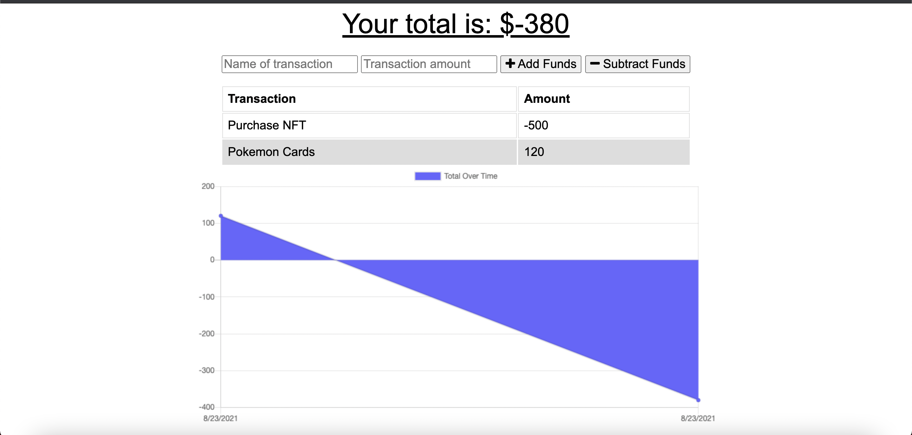

# Budget-Tracker

## Description

The goal for this project was to convert a budget tracker application into a PWA, link it to a database as well as deploy it live on heroku. 
This application can be downloaded and used online to track you budget whenever you need to monitor your expenses over time. 

## Installation 

This application is currently deployed on heroku at: https://stormy-scrubland-15003.herokuapp.com/

To download and install the application on your smartphone or computer, in the address bar there is a button to click to install. 

## Usage

Here is an example of how this application is used and looks:

A person can add transactions by entering information into the forms then pressing "add funds" or "subtract funds". 